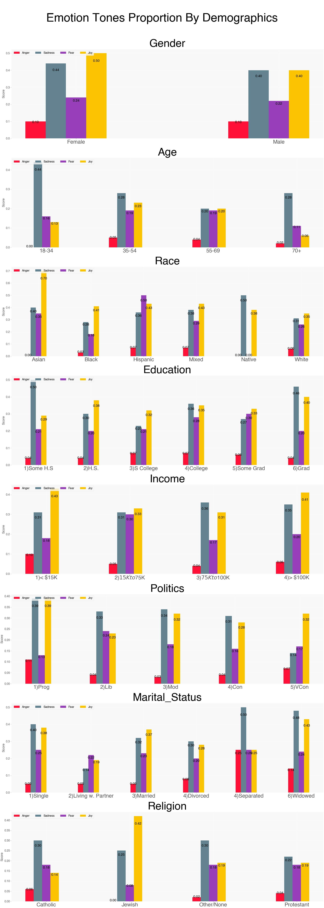
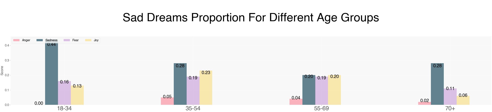

# Dream Analysis

“The interpretation of dreams is the royal road to a knowledge of the unconscious activities of the mind.” ― Sigmund Freud, The Interpretation of Dreams (1900)

## Introduction
The main objective of this analysis is to provide data-driven insights into one of the many obscure activities of the brain, dream, and its interpretation. What kind of emotional responses can we expect from our dreams? Are dreams a tiny glimpse into our figment of imagination or perhaps asked differently, are dreams the manifestations of who we are and our daily experiences? Although the interpretation of any dream will only make sense in the context of the dreamer's life, I suspect individuals with shared backgrounds and experiences display relatively similar emotions from their dreams to those from different backgrounds. 

## Motivation
Dreams have always fascinated me. In my dreams, I have fulfilled my deepest desires, experienced incredible moments, felt shock and horror, and done things that defy the law of physics.  This led me to the question can dreams be answered with data? With this project, I analyze dream entries of random participants to validate hypotheses using statistics. 

## Methodology

1. Web-scrapped a subset of the Sleep and Dream Database (SDDb), a digital archive and search engine developed by a psychologist and dream researcher Kelly Bulkeley, Ph.D. As of Apr 2021, the database has a little over 34,000 dream entries from participants with varying backgrounds. 

2. Filtered the dataset by the association of the dreams to "Fire", "Air", "Water", and "Earth" keywords, which yielded ~17% of the SDDb, each dream recorded with the appropriate associated survey series, date, and details such as demographics or dream related measurements of the dreamer (e.g., recollection/insomnia).

3. Applied [TextBlob sentiment analysis ](https://textblob.readthedocs.io/en/dev/) to the dream entries. TextBlob is a python library that uses Natural Language Processing to analyze the sentiment of the textual information in terms of polarity and subjectivity. 

Polarity measures the degree of positive or negative attitude detected from the text. The result is in the range of `[-1.0, 1.0]`, where `-1.0` is the highest point for negative polarity and `1.0` for positive.

Subjectivity identifies the level of subjectivity/objectivity in the given text, given in the range of `[0.0, 1.0]`, as `1.0` indicating the most subjective text and `0.0` the least. 

4. Run the dream logs through[ IBM Watson tone analyzer](https://www.ibm.com/watson/services/tone-analyzer/), a tool that can analyze the emotional and language tones in a text using linguistic analysis at a document and sentence level. Below is the definition of each tone provided by Watson tone analyzer documentation. 

## Exploritory Data Analysis (EDA)

The polarity metrics show that at a high level, the majority of the groups tend to have either neutral dreams or slightly leaning towards the positive spectrum. The points that stand out (with a larger volume of data as exhibited with the size of the bubble) are as follows:

- Gender: The female and male groups have a relatively similar level of polarity
- Age: The two extreme opposite age groups show the highest variance from each other with the latter group leaning towards the positive side
- Race: Not enough data collected in the race demographics to make any inference with certainty 
- Education: An increase in the level of education does not show a strong relation to dream polarity
- Income: Those in the higher income bracket (> $100K) have the highest polarity in comparison to the lower-income groups
- Politics: Although conservatives seem to have a higher polarity attributed to their group, it is surprising to also find that the very conservative groups have an average polarity score similar to that of liberals
- Marital Status: Larger volume of data in this category comes from single and married participants, from which married groups have the higher average polarity score
- Religion: similar to race, the majority of the participants lie in just one category, in this case, "other/none". However, the identified the three religions, Protestant, Catholic, and Jewish followers to have roughly the same polarity measurement. 

Next, we look at emotion tone scores: mean of each emotion tone and proportion of each emotion tone. Both metrics at the segmented demographics level. The mean score chart doesn't show any materially significant difference between the score of each group. 

The emotion tone proportion, on the other hand, informs a different and far more interesting story. Overall, the proportion of sadness and joyous dreams appear much higher than anger and fear indicative dreams. This aligns with what we have seen earlier with the polarity assessment. A higher proportion of dreams evoke joyful feelings.

*Please note that some areas where bars are blank or zero is due to lack of data. 

Subsequently, we look at language tone proportions. It came as no surprise that the majority of the dreams have a tentative underlying tone, after all, it makes sense that people are unsure and inquisitive of their dreams. But why is the analytical proportion low? Potentially participants are just documenting their dreams in the survey and proceeding with the reasoning and finding interpretations of their dreams outside the survey. A notable trend is dreamers with a higher level of education have a higher analytical proportion than those with lower-level academic achievements. 

## Hypothesis Tests

Let's focus our attention and do further investigation as a follow-up on the above chart for the sad dreams proportion with the different age groups. 

 
Assumption to test: sad dreams proportions are different for younger adults vs older adults.

Ho: younger vs older adults have equal proportions of sad dreams 
Ha: sadness dream proportions are different between those two groups

