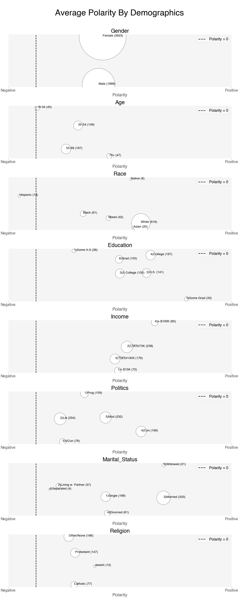
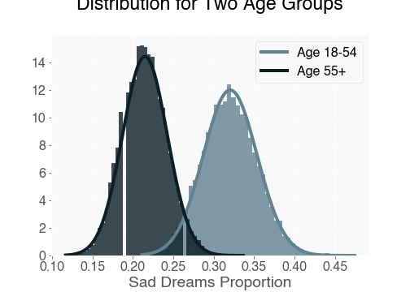

# Dream Interpretation

“The interpretation of dreams is the royal road to a knowledge of the unconscious activities of the mind.” ― Sigmund Freud, The Interpretation of Dreams (1900)

## Introduction
The main objective of this analysis is to provide data-driven insights into one of the many obscure activities of the brain: dream, and its interpretation. What kind of emotional responses can we expect from our dreams? Are dreams a tiny glimpse into our figment of imagination or perhaps asked differently, are dreams the manifestations of who we are and our daily experiences? Although the interpretation of any dream will only make sense in the context of the dreamer's life, I suspect individuals with shared backgrounds and experiences display relatively similar emotions from their dreams than to those from different backgrounds. 

## Motivation
Dreams have always fascinated me. In my dreams, I have fulfilled my deepest desires, experienced incredible moments, felt shock and horror, and even done things that defy the law of physics.  This led me to the question can the interpretation of dreams be answered with data? With this project, I analyze dream entries of random participants to validate hypotheses using statistics. 

## Methodology

1. Web-scrapped a subset of the [Sleep and Dream Database (SDDb)](https://sleepanddreamdatabase.org/), a digital archive and search engine developed by a psychologist and dream researcher Kelly Bulkeley, Ph.D. As of Apr 2021, the database has a little over 34,000 dream entries from participants with varying backgrounds. 

2. Filtered the dataset by the association of the dreams to "Fire", "Air", "Water", and "Earth" keywords, which yielded ~17% of the SDDb, each dream recorded with the appropriate associated survey series, date, and details such as demographics or dream related measurements of the dreamer (e.g., recollection/insomnia). Here is a sample dream journal from the racial justice survey series.

    

3. Applied [TextBlob sentiment analysis ](https://textblob.readthedocs.io/en/dev/) to the dream entries. TextBlob is a python library that uses Natural Language Processing to analyze the sentiment of the textual information in terms of polarity and subjectivity. 

    Polarity measures the degree of positive or negative attitude detected from the text. The result is in the range of `[-1.0, 1.0]`, where `-1.0` is the highest point for negative polarity and `1.0` for positive.

    Subjectivity identifies the level of subjectivity/objectivity in the given text, given in the range of `[0.0, 1.0]`, as `1.0` indicating the most subjective text and `0.0` the least. 

4. Run the dream logs through[ IBM Watson tone analyzer](https://www.ibm.com/watson/services/tone-analyzer/), a tool that can analyze the emotional and language tones in a text using linguistic analysis at a document and sentence level. Below is the definition of each tone provided by Watson tone analyzer documentation. 

    

## Exploritory Data Analysis (EDA)

The polarity metrics show that at a high level, the majority of the groups tend to have either neutral dreams or slightly leaning towards the positive spectrum. The points that stand out (with a larger volume of data as exhibited with the size of the bubble) are as follows:

- Gender: The female and male groups have a relatively similar level of polarity
- Age: The two extreme opposite age groups show the highest variance from each other with the latter group leaning towards the positive side
- Race: Not enough data collected in the race demographics to make any inference with certainty 
- Education: An increase in the level of education does not show a strong relation to dream polarity
- Income: Those in the higher income bracket (> $100K) have the highest polarity in comparison to the lower-income groups
- Politics: Although conservatives seem to have a higher polarity attributed to their group, it is surprising to also find that the very conservative groups have an average polarity score similar to that of liberals
- Marital Status: Larger volume of data in this category comes from single and married participants, from which married groups have the higher average polarity score
- Religion: Similar to race, the majority of the participants lie in just one category, in this case, "other/none". However, the identified three religions, Protestant, Catholic, and Jewish followers have roughly the same polarity measurement. 

 
 
 
Next, we look at emotion tone scores: mean of each emotion tone and proportion of each emotion tone (―both metrics at the segmented demographics level). The mean score chart doesn't show any materially significant difference between the score of each group. 

 
 
 
The emotion tone proportion, on the other hand, informs a different and far more interesting story. Overall, the proportion of sadness and joyous dreams appear much higher than anger and fear indicative dreams. This aligns with what we have seen earlier with the polarity assessment. A higher proportion of dreams evoke joyful feelings.

*Please note that some areas where bars are blank or zero is due to lack of data. 

 
 
 
Subsequently, we look at language tone proportions. It came as no surprise that the majority of the dreams have a tentative underlying tone, after all, it makes sense that people are unsure and inquisitive of their dreams. But why is the analytical proportion low? Potentially participants are just documenting their dreams in the survey and proceeding with the reasoning and finding interpretations of their dreams outside the survey. A notable trend is dreamers with a higher level of education have a higher analytical proportion than those with lower-level academic achievements. 
 
 
 

 
 
 

## Hypothesis Tests

Let's focus our attention and do a further investigation as a follow-up on the above chart for the sad dreams proportion with the different age groups. 

 
Assumption to test: sad dreams proportions are different for younger adults vs older adults.

Ho: younger and older adults have equal proportions of sad dreams 
Ha: sadness dream proportions are different between those two groups

After running a difference in two proportions two-tailed hypothesis test, we can see that the probability that the younger and older adults have different proportions given the null hypothesis is ~ 1%, which is much lower than the initial acceptable rate we decided at the start of the test (i.e., alpha of 5%). Therefore, we have sufficient evidence to reject the null hypothesis in favor of the alternative hypothesis. 

Bootstrapping the sample proportion of sad dreams in the younger and older age group suggests a reason to believe that the younger adults have more sad dreams than their opposite counterparts in age. This is demonstrated with the below chart that shows the distribution of the mean of the sample proportions with the resampling size of 10,000 times. 

From the above distribution, it is evident that the proportion of sad dreams is higher in younger adults than older. To claim this statement with some level of statistical certainty, we can then perform a right-tailed hypothesis test.

Ho: younger adults have lower or equal proportion of sad dreams than older adults 
Ha: younger adults have higher proportion of sad dreams than older adults

The right-tailed test indicates that it is highly unlikely we test a sample of a higher proportion of sad dreams in younger adults provided the null hypothesis is true, therefore producing evidence to reject the null hypothesis. 

 
 
Another enlightening chart is the proportion of dream tones over time. Although each tone line fluctuates every two years or so, overall it maintains a relatively flat rate throughout the last decade except for joy. Joyful dreams plummeted starting early 2020 from about 61% to 9%. This could very well be attributed to the global pandemic and racial injustice issues. 

Another potential area I'd like to further investigate from here is the proportion difference in joyful dreams for liberals and conservatives during different presidencies. I assume that joyous dreams were ubiquitous for conservatives during the republican presidency while scarce for liberals during the same period. Thus, I structured my two hypotheses in the following format:

Assumption to test: joy dreams proportions were higher for conservatives during republican presidency.

Ho: conservatives have equal proportion of joy dreams in any presidency  
Ha: conservatives have higher proportion of joy dreams during republican presidency than democrat presidency. 

The result shows that there is evidence for one portion of our initial assumption. With the null hypothesis rejected, we can make the statement at a 95% confidence level that conservatives sleep better at night with their dreams inducing joyous feeling during Republican president. 

Similary, I run a test for difference in proportion test for joyful dreams for liberals under the two different presidencies. 

It turns out that liberals had a slightly higher proportion of joyous dreams in the republican presidency than under a democrat one. Here, we fail to reject our null hypothesis. Now we know that by the end of the last Republican presidency, joyous dreams have plummeted across the board. So could this be related to liberals giving the last president a shot at the earlier period of his presidency? Remains to be further investigated. 

## Parting Thoughts

Dreams are interprated in radically different ways. According to Sigmund Freud's publication in 1899, dreams are symbolic representations of our unconscious thoughts. Dreams were first studied scientifically late in the late 1900s by Calvin Hall who theorized that dreams are depictions of who we are and how we see the world. In this lane, the cognitive approach asserts that dreams occur during the rapid eye movement(REM) phase of sleep as the brain transfers neurological activity and stores in memories. Finally, the latest research in the neuroscience approach dream interpretation in terms of how the neuron networks behave differently during sleep phases. 

Barely scratching the surface of this in-depth topic, it is clear that dreams are not just meaningless flashing of disjointed thoughts. Even on an emotional level, dreams can trigger feelings that mimic that of realistic ones, even for a shorter duration. The dream tones data analysis shows statistically supported evidence for such claims. 

## Next Step Ideas

So much more can be done with the other demographics data. I have only done a close-up investigation on age and politics, however, I suspect, income, education, and marital status will tell other interesting stories. Additionally, the dataset also has other informative columns to work with such as insomnia nights per week, dream recollection per week, survey series (pandemic series, radcial justice series and so forth), typical dream types(visitations, sexual, being chased, awareness etc). These are unexplored areas of my dataset that peek my interest for additional work on this project. 

